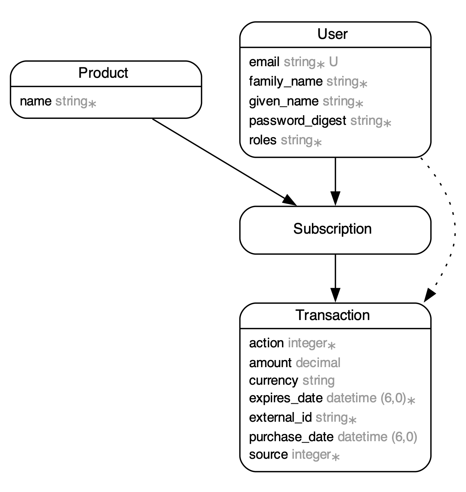

# Ruby Test

This is a backend implementation to demonstrate basic subscription workflows.  It leverages [Ruby on Rails](https://rubyonrails.org/) with [Sorbet](https://sorbet.org/) for type checking.  Sorbet is primarily useful for helping to verify correctness and to make the code "self documenting" for other developers which is more difficult with doc comments alone.

## Setup

1. Install [Rails](https://guides.rubyonrails.org/install_ruby_on_rails.html) for your basic setup.  After running bundle you will have your available commands. I recommend using aliases to reduce typing of commands.

2. Add [Sorbet](https://sorbet.org/docs/vscode) and [Rubocop](https://docs.rubocop.org/rubocop/latest/integration_with_other_tools.html) to your IDE.

3. Add command aliases so you don't need to repeatedly type `bundle exec`.

For macOS or Linux, Add this to your `~/.zprofile` or `~/.bash_profile`:

```sh
alias tapioca="bundle exec tapioca"
alias rails="bundle exec rails"
alias srb="bundle exec srb"
alias rubocop="bundle exec rubocop"
```

And then reload your terminal.  You should now be able to type `tapioca`, `rails`, or `srb` for
the respective commands.

4. Initialize your database with `rails db:migrate:reset`

5. When making changes to the db or your models update your sorbet types with `tapioca dsl`.  If you add a gem, run `tapioca gem`.  This will allow correct completion and type checking.

6. [Configure your Rail credentials](https://guides.rubyonrails.org/security.html#custom-credentials) to include a secret key `hmac_secret` for JSON Web Tokens with `rails credentials:edit`.

## Database



There are 4 primary data types in the application.

### User

The users of the system.  Apple web hooks have a role of "apple"
given access to the `/v1/webhooks/apple/transaction` api.

### Product

A product that can be subscribed to, such as a monthly subscription.

### Subscription

A subscription that a user has created.  It can be in a purchased, cancelled, or renewed state based off of the last executed transaction.  Apple transactions are created through the apple webhook. When there are no transactions, the subscription is not yet active.

### Transaction

A record of actions by the user used for finding the current subscription state as well as for viewing a history of previous transactions.

Transactions must be sequential into the future and never overlap.

FUTURE: There is an enum to describe where the transaction source.  It currently only supports "apple", but "google" and "web" are future possible payment sources.

## API

Api Documentation is generated using [rswag](https://github.com/rswag/rswag?tab=readme-ov-file#getting-started). You can view the api documentation by starting the webserver `rails s` and navigating to `http://localhost:3000/api-docs`.

If you are developing the api docs, you can rebuild it with `RAILS_ENV=test rails rswag`.

In order to used endpoints that require authentication, you must use the login endpoint, and then apply the api token in the format of `"Bearer #{token}"`.

APIs are scoped by version.  You can find details on how to call the API in
the controllers.

### Testing

Run tests with `rails test`.  Each controller has its own set of tests in `test/controllers`, and there are user flow tests in `test/integration`.

The `test/test_helpers/testing.rb` module is used to automate some repetitious tasks, such as registering a user and logging in.

# サブスクリプション管理システムの実装

動画配信サービスにおける定期購読の開始・更新・解約を管理する API を Ruby on Rails で実装してください

実務に耐えうる設計・実装（拡張性・分析可能性・冪等性・スケーラビリティ等）を意識し、README に設計の概要や工夫したポイントを記載してください（日本語もしくは英語）

不明点は適切に定義して構いません

- ユーザは Apple のアプリ内課金でサブスクリプションを購入する
- 決済完了後、アプリ側から Rails API に決済情報を送信し、サブスクリプションを仮開始する
- その後、Apple からの Webhook 通知（開始・更新・解約）を受信して、サブスクリプションの状態を更新する。署名検証は省略して良い
- 解約時でも現在の有効期限までは利用可能とする

評価の観点：要件定義力・設計力・拡張性・説明力

## クライアント -> サーバ (決済完了直後)

```json
{
  "user_id": "string",
  "transaction_id": "string",
  "product_id": "string"
}
```

- user_id: 本来は Cookie 等から取得する値だが、今回わかりやすくするためパラメータとして渡す形にする。検証不要
- transaction_id: サブスクリプションを一意に識別する ID。同じサブスクリプションなら自動更新されても同じ値
- product_id: サブスクリプションプランの ID。例：com.samansa.subscription.monthly

この時点では仮開始。Apple Webhook 到着で本開始。仮開始中は視聴不可。

## Apple -> サーバ （Webhook）

```json
{
  "notification_uuid": "string",
  "type": "PURCHASE" "RENEW" "CANCEL",
  "transaction_id": "string",
  "product_id": "string",
  "amount": "3.9",
  "currency": "USD",
  "purchase_date": "2025-10-01T12:00:00Z",
  "expires_date": "2025-11-01T12:00:00Z",
}
```

- notification_uuid: 通知ごとに一意の値
- type: 通知の種類。PURCHASE は新規購入、RENEW は自動更新、CANCEL は解約
- transaction_id: サブスクリプションを一意に識別する ID。同じサブスクリプションなら自動更新されても同じ値
- product_id: サブスクリプションプランの ID。例：com.samansa.subscription.monthly
- amount / currency: 課金金額と通貨
- purchase_date: 現在のサブスクリプション期間の開始日時
- expires_date: 次回更新またはサブスクリプション終了日時

ENGLISH

# Subscription Management System Implementation

Please implement an API in Ruby on Rails to manage subscription start, renewal, and cancellation for a video streaming service.

Design and implement the system with production-level considerations such as extensibility, analyzability, idempotency, and scalability. Also, include a README describing the design overview and key considerations (in Japanese or English).

You may define any unspecified details appropriately.

- Users purchase subscriptions via Apple In-App Purchases.
- After payment is completed, the app sends payment information to the Rails API, and the subscription is provisionally started.
- After that, the system receives webhook notifications from Apple (start, renewal, cancellation) and updates the subscription status accordingly. Signature verification can be omitted.
- Even after cancellation, users can continue using the service until the current expiration date.

**Evaluation criteria:** requirement definition, system design, extensibility, and clarity of explanation.

---

## Client → Server (Immediately after payment)

```json
{
  "user_id": "string",
  "transaction_id": "string",
  "product_id": "string"
}
```
````

https://developer.apple.com/documentation/appstoreconnectapi/webhook

- user_id: Normally obtained from cookies, etc., but for simplicity in this task, it is passed as a parameter. No validation required.
- transaction_id: A unique ID identifying the subscription. It remains the same even after auto-renewals.
- product_id: The subscription plan ID (e.g., com.samansa.subscription.monthly)

At this stage, the subscription is only provisionally started. It becomes fully active upon receiving the Apple webhook. Users cannot access content during the provisional state.

---

## Apple → Server (Webhook)

```json
{
  "notification_uuid": "string",
  "type": "PURCHASE" "RENEW" "CANCEL",
  "transaction_id": "string",
  "product_id": "string",
  "amount": "3.9",
  "currency": "USD",
  "purchase_date": "2025-10-01T12:00:00Z",
  "expires_date": "2025-11-01T12:00:00Z"
}
```

- notification_uuid: A unique value per notification
- type: Notification type. PURCHASE = new purchase, RENEW = auto-renewal, CANCEL = cancellation
- transaction_id: A unique ID identifying the subscription. It remains the same across renewals
- product_id: Subscription plan ID (e.g., com.samansa.subscription.monthly)
- amount / currency: Charged amount and currency
- purchase_date: Start date/time of the current subscription period
- expires_date: Next renewal date or subscription end date


